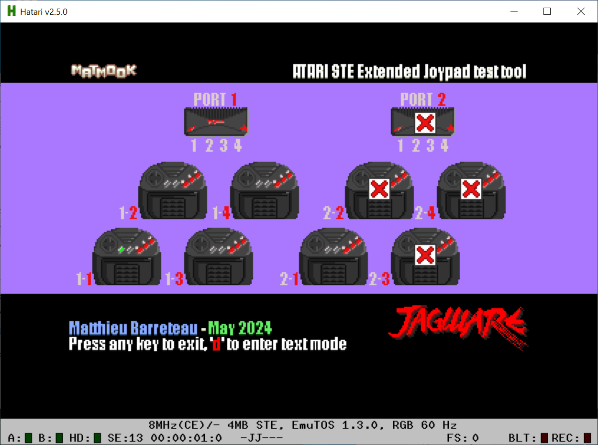
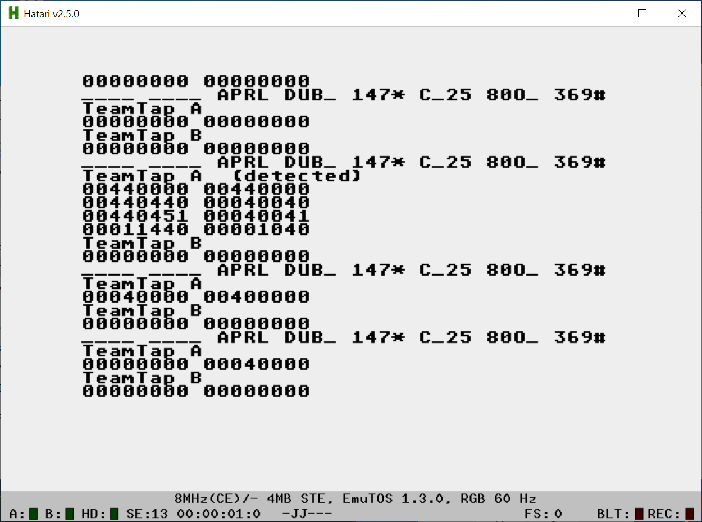

# Atari-Teamtap-Checker
An STE/Falcon application to test Extended Joystick ports

Well, I was playing with the TeamTap so I took the opportunity to learn some stuff on the STE, including:
- system detection (Cookie Jar)
- Timer B interrupt (moar colors needed! :D)
- STE palette and video modes
- ST bitmap plan management (how to use masks)

When on an STE, with a color screen, you have the ability to use both graphical and text modes.

On a Falcon, text mode is the only one available.

**Graphical mode**

Any press on any Jagpad will show the relevant changes on screen.

**Text mode**

Any press on any Jagpad will dump the relevant bytes on the console.

Matthieu Barreteau (Matmook) - May 2024